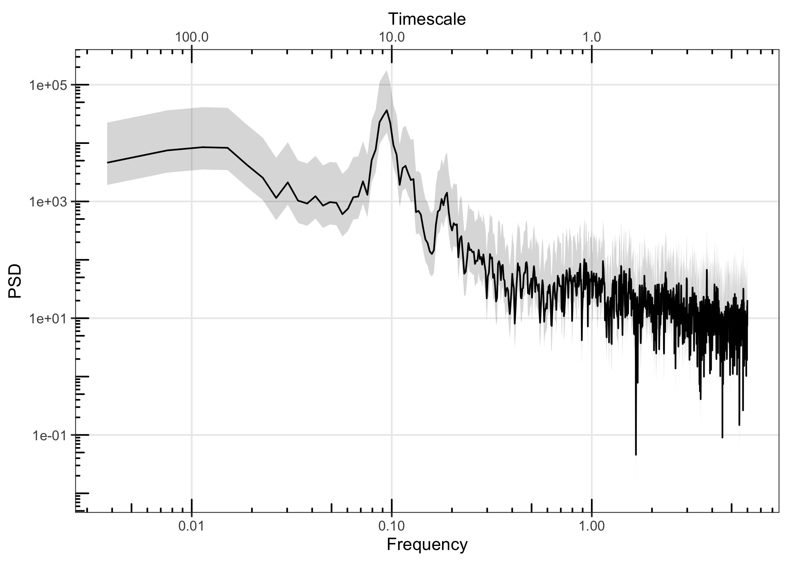

<!-- README.md is generated from README.Rmd. Please edit that file -->

# PaleoSpec

<!-- badges: start -->

[](https://app.codecov.io/gh/EarthSystemDiagnostics/paleospec?branch=master)
<!-- badges: end -->

PaleoSpec is an R package to assist in the spectral analysis of
timeseries, in particular timeseries of climate variables from
observational, model, and proxy paleoclimate data sources. PaleoSpec
contains functions to analyse existing timeseries and to generate
timeseries with specific spectral properties.

## Installation

You can install the development version of PaleoSpec from
[GitHub](https://github.com/) with:

``` r
# install.packages("devtools")
devtools::install_github("EarthSystemDiagnostics/paleospec")
```

Please refer to function references here:

<https://earthsystemdiagnostics.github.io/paleospec/reference/index.html>

## Usage

### Simulating timeseries with given spectral properties

`SimPLS` can be used to create a timeseries whose power spectrum has
powerlaw like properties, where: $S(f) = \alpha f^{-\beta}$

``` r
library(PaleoSpec)
set.seed(20221109)
N <- 1e04

alpha <- 0.1
beta <- 1

ts1 <- SimPLS(N = N, b = beta, a = alpha)

plot(ts1, type = "l")
```


`SpecMTM` can be used to estimate the power spectrum of a timeseries
using the multitaper method (ref)

``` r
sp1 <- SpecMTM(ts1)
#> Warning in multitaper::spec.mtm(timeSeries = timeSeries, k = k, nw = nw, : Time
#> series is not a ts object and deltat is not set. Frequency array and axes may be
#> incorrect.
```

The `LPlot` function will plot a power spectrum on log10-log10 axes.

``` r
LPlot(sp1)
abline(log10(alpha), -beta, col = "red")
```


You can add confidence intervals to the spectral estimates with
`AddConfInterval`

``` r
sp1 <- AddConfInterval(sp1)
LPlot(sp1)
abline(log10(alpha), -beta, col = "red")
```


The `LogSmooth` function can be used to smooth power spectra with
equally spaced filter in log-space.

``` r
sp1_f <- LogSmooth(sp1, df.log = 0.01)
LPlot(sp1)
LLines(sp1_f, col = "green")
```


