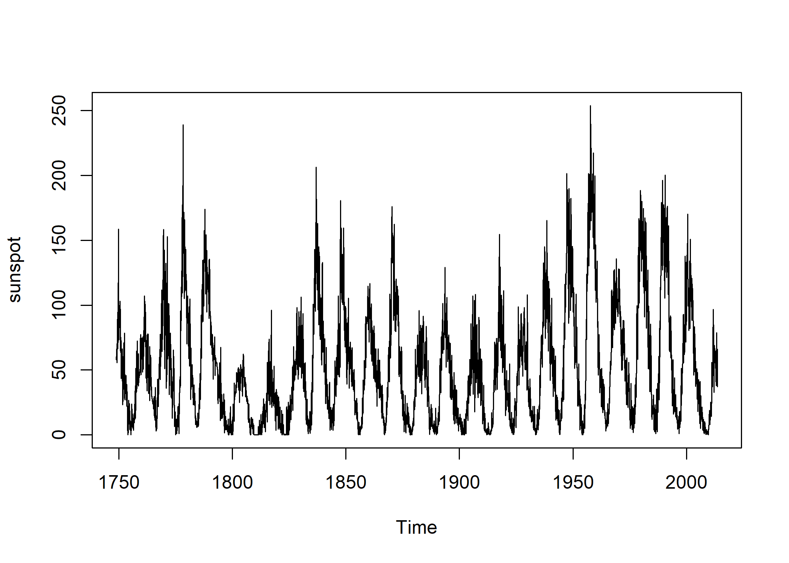
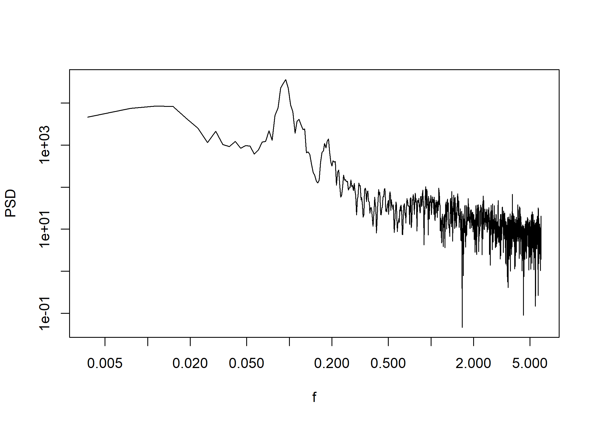
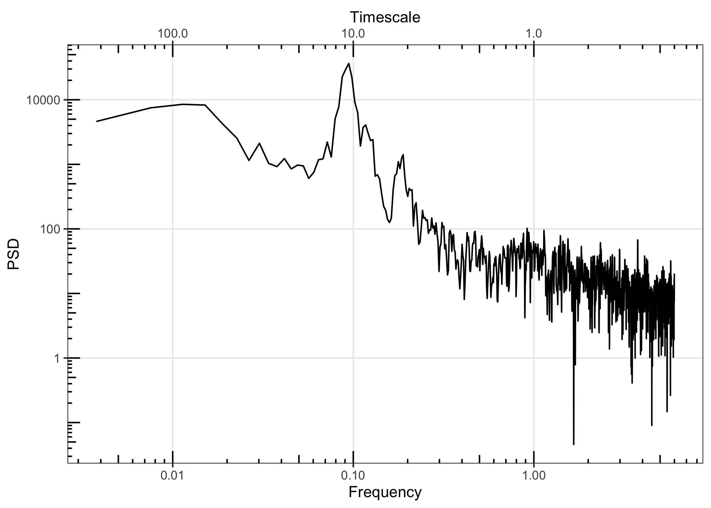
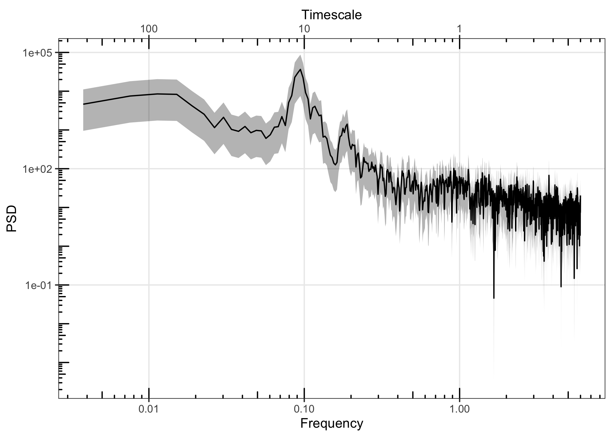
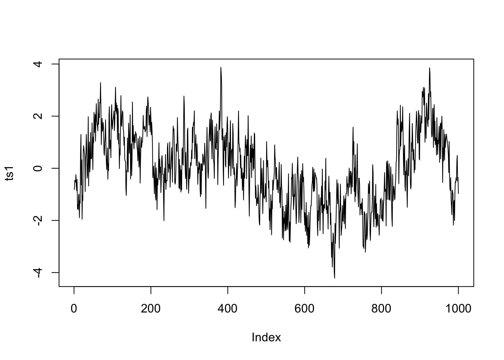
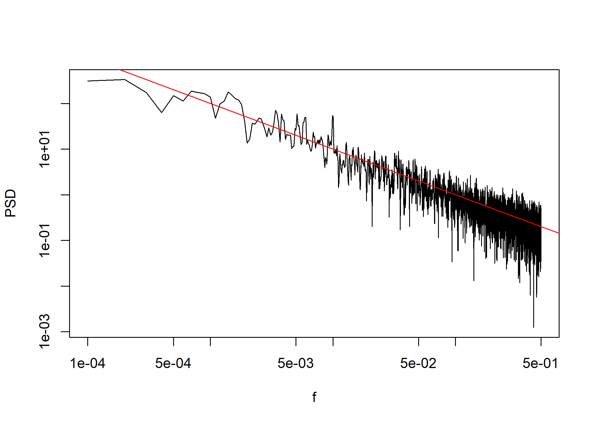
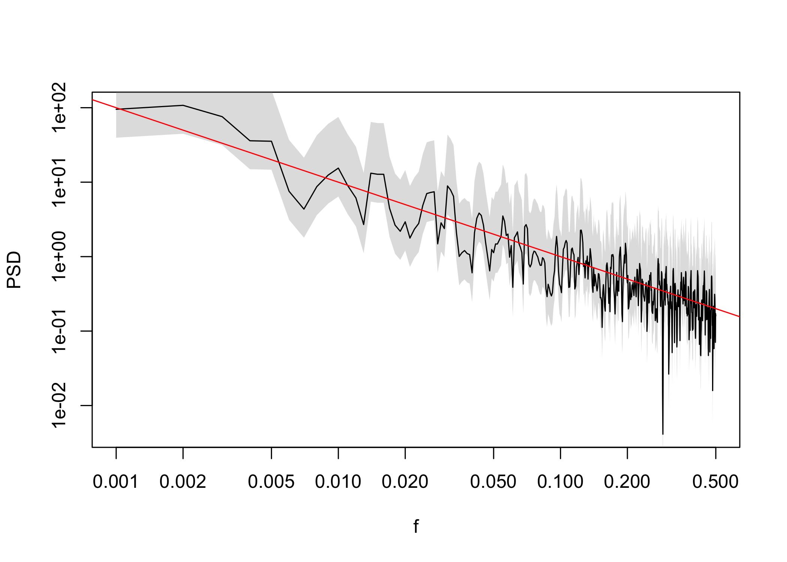
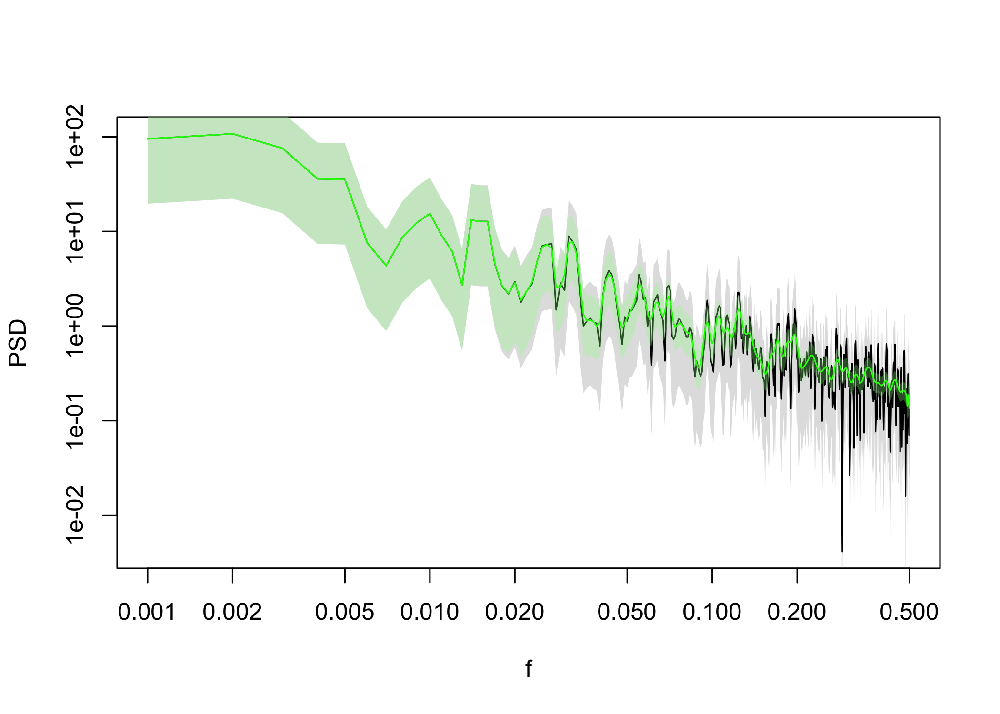

# PaleoSpec

PaleoSpec is an R package to assist in the spectral analysis of
timeseries, in particular timeseries of climate variables from
observational, model, and proxy paleoclimate data sources. PaleoSpec
contains functions to analyse existing timeseries and to generate
timeseries with specific spectral properties.

## Installation

You can install the development version of PaleoSpec from
[GitHub](https://github.com/) with:

``` r

# install.packages("remotes")
remotes::install_github("EarthSystemDiagnostics/paleospec")
```

Please refer to function references here:
<https://earthsystemdiagnostics.github.io/paleospec/reference/index.html>

## Usage

### Estimating power spectra

`SpecMTM` can be used to estimate the power spectrum of a timeseries
using the multitaper method.

Here we estimate the spectrum of the monthly sunspot data that comes
with R. The sunspot data are already a timeseries object so SpecMTM
knows the correct frequency of the observations. We can plot the power
spectrum with the PaleoSpec function LPlot.

``` r

sunspot <- datasets::sunspot.month
plot(sunspot)
```



``` r

library(PaleoSpec)
sp_sun <- SpecMTM(sunspot)
LPlot(sp_sun)
```



Alternatively we can use the gg_spec() function to get a ggplot2

``` r

gg_spec(sp_sun)
#> Scale for colour is already present.
#> Adding another scale for colour, which will replace the existing scale.
```



Appproximate confidence intervals can be added with the function
AddConfInterval()

``` r

sp_sun <- AddConfInterval(sp_sun)
gg_spec(sp_sun)
#> Scale for colour is already present.
#> Adding another scale for colour, which will replace the existing scale.
```



### Simulating timeseries with given spectral properties

`SimPLS` can be used to create a timeseries whose power spectrum has
powerlaw like properties, where: $`S(f) = \alpha f^{-\beta}`$

``` r

# setting the seed of the random number generator so that this example will 
# always generate the same time series
set.seed(20221109)

# length of the time series
N <- 1e03

# parameters of the powerlaw spectrum
alpha <- 0.1
beta <- 1

ts1 <- SimPLS(N = N, b = beta, a = alpha)
plot(ts1, type = "l")
```



`SpecMTM` can again be used to estimate the power spectrum using the
multitaper method. If we convert the vector from SimPLS to a timeseries
object, and add information about the sampling frequency of the
timeseries then SpecMTM will have the correct frequency axis.

``` r

sp1 <- SpecMTM(ts(ts1, deltat = 1))

LPlot(sp1)
abline(log10(alpha), -beta, col = "red")
```



You can add confidence intervals to the spectral estimates with
`AddConfInterval`

``` r

sp1 <- AddConfInterval(sp1)
LPlot(sp1)
abline(log10(alpha), -beta, col = "red")
```



The `LogSmooth` function can be used to smooth power spectra with
equally spaced filter in log-space.

``` r

sp1_f <- LogSmooth(sp1, df.log = 0.01)
LPlot(sp1)
LLines(sp1_f, col = "green")
```


